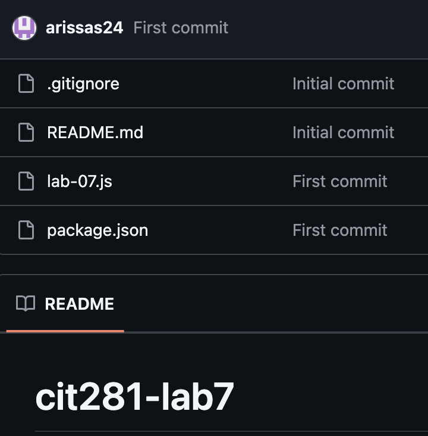

# Project 6: Client-Server To-Do List Application

Welcome to my Project 6 page for **CIT 281**.

---

## Purpose

For this project, I built a client-server To-Do List web application using Express.js. I enhanced my skills with HTTP methods like GET, POST, PUT, and DELETE, and managed data with a server-side memory object as a simple database. I also used AI tools to assist in development and practiced version control using Git and GitHub. This project gave me practical experience creating a full client-server app tailored to my interests.

---

## Technologies Used

- Visual Studio Code (VSCode)
- Node.js
- Express.js
- JavaScript
- HTML/CSS
- Git
- GitHub

---

## Lab 7: 

In this lab, I created a personal GitHub Pages website, practiced cloning repositories, initialized a Node.js project, and wrote JavaScript code with error handling to strengthen my understanding of GitHub workflows.

---

## Lab 8: Fetching Photo Data with Express and REST APIs

In this lab, I learned how to use fetch() and JavaScript promises to handle asynchronous requests to a REST API, set up an Express server to serve JSONPlaceholder photo data, and integrate client-side code to interact with the server through dynamically retrieved data.

---

## Lab 9:

In this lab, I worked through the GitHub Learning Lab course for creating a release based workflow.

---

## What I Learned

- How to implement API routes to handle task operations
- How to manage client-side functionality using JavaScript and dynamic DOM updates
- How to create a GitHub Pages personal website
- How to generate and update client files (HTML, CSS, JS) using AI tools
- How to create a release based workflow

---

## Project Images

---

## Lab 7 Images

---

## Lab 8 Images

---

Thanks for visiting my Project 6 page!

[Back to Portfolio](https://arissas24.github.io/)
